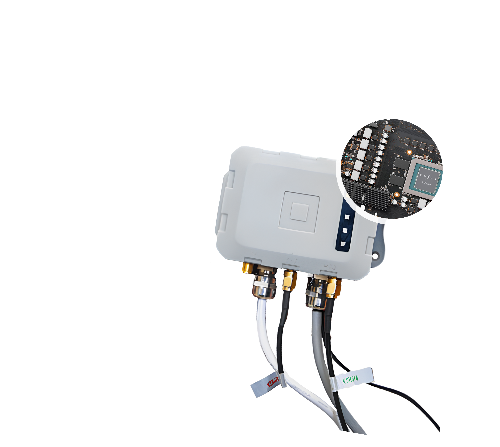

# HomotopicAI

-   :material-cpu-64-bit:{ .lg .middle } __MAP™ Device__

    ---

    

## Key Innovations
- Symbolic AI Acceleration: Native execution of mathematical operations
- Photonic Interconnects: Revolutionary data transfer technology
- Energy-Efficient Supercomputing: Data-center power in your pocket

## About MAP™
Born out of MIT, HomotopicAI is a Mathematics R&D Company building the world's first Math-Aware Processor (MAP™) Brick. MAP™ is a pocket-sized supercomputer that democratizes supercomputing by condensing data-center-grade power into a portable, cloudless device.

## Mission
Our mission is to democratize access to supercomputing, making it cloudless, personal and portable.

## Vision
Our vision is a world where advanced computing isn't tied to the cloud.

## Get Started
- [Explore the Future](product/overview.md)
- [Join Early Access](developer/sdk.md)

## Quick Links
- [Pocket Supercomputer](map.md)
- [Solutions](solutions.md)
- [Tech](technology.md) 