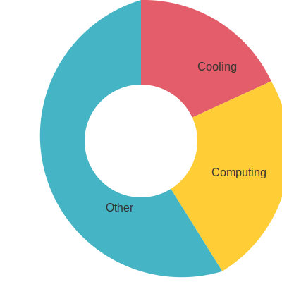

# Environmental Impact of Cloud Computing

    <h1 class="display-4 mb-4"><i class="fas fa-leaf text-danger"></i> The Hidden Environmental Cost</h1>
    
Data centers are among the world's largest energy consumers, contributing significantly to global carbon emissions.

    

        

            <i class="fas fa-bolt text-danger"></i>
        

        <h3>Energy Consumption</h3>
        <ul class="feature-list">
            <li><i class="fas fa-times"></i> Massive power requirements</li>
            <li><i class="fas fa-times"></i> 24/7 operation cycle</li>
            <li><i class="fas fa-times"></i> Cooling system demands</li>
            <li><i class="fas fa-times"></i> Infrastructure overhead</li>
        </ul>
    

    

        

            <i class="fas fa-temperature-high text-danger"></i>
        

        <h3>Carbon Footprint</h3>
        <ul class="feature-list">
            <li><i class="fas fa-times"></i> High CO2 emissions</li>
            <li><i class="fas fa-times"></i> Fossil fuel dependency</li>
            <li><i class="fas fa-times"></i> E-waste generation</li>
            <li><i class="fas fa-times"></i> Resource depletion</li>
        </ul>
    

    

        

            <i class="fas fa-water text-danger"></i>
        

        <h3>Water Usage</h3>
        <ul class="feature-list">
            <li><i class="fas fa-times"></i> Cooling system consumption</li>
            <li><i class="fas fa-times"></i> Local water stress</li>
            <li><i class="fas fa-times"></i> Ecosystem impact</li>
            <li><i class="fas fa-times"></i> Resource competition</li>
        </ul>
    

    <h2 class="text-center mb-4">Environmental Impact</h2>
    

        

            
2%

            
Global Electricity

            
Consumed by data centers

        

        

            
130B

            
Gallons of Water

            
Used annually for cooling

        

        

            
100M

            
Metric Tons CO2

            
Annual emissions

        

    

    <h2 class="text-center mb-4">Data Center Energy Usage</h2>
    

        
        

            

                
                Cooling (40%)
            

            

                
                Computing (35%)
            

            

                
                Other (25%)
            

        

    

    <h2 class="text-center mb-4">Environmental Impact Comparison</h2>
    

        <table class="table table-bordered">
            <thead class="table-dark">
                <tr>
                    <th>Factor</th>
                    <th>Cloud Data Center</th>
                    <th>MAP™ Brick</th>
                </tr>
            </thead>
            <tbody>
                <tr>
                    <td>Power Usage</td>
                    <td class="text-danger">Megawatts</td>
                    <td class="text-success">Watts</td>
                </tr>
                <tr>
                    <td>Cooling Needs</td>
                    <td class="text-danger">Industrial HVAC</td>
                    <td class="text-success">Passive Cooling</td>
                </tr>
                <tr>
                    <td>Water Usage</td>
                    <td class="text-danger">Millions of Gallons</td>
                    <td class="text-success">None</td>
                </tr>
                <tr>
                    <td>E-Waste</td>
                    <td class="text-danger">Regular Hardware Turnover</td>
                    <td class="text-success">Long Lifespan</td>
                </tr>
            </tbody>
        </table>
    

    <h2 class="mb-4">Join the Green Computing Revolution</h2>
    
Switch to MAP™ Brick and reduce your carbon footprint.

    <button class="btn btn-primary btn-lg" disabled>Calculate Impact</button>
    <small class="d-block mt-2 text-muted">(Coming Soon)</small>

