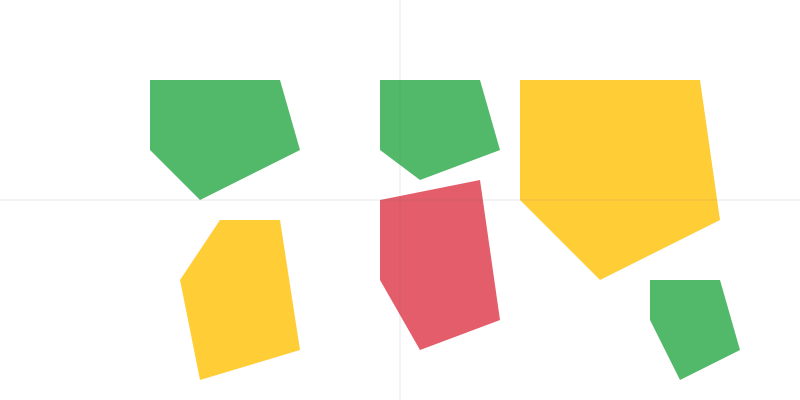

# Social Impact of Cloud Computing

    <h1 class="display-4 mb-4"><i class="fas fa-users text-danger"></i> The Digital Divide Deepens</h1>
    
Cloud computing's centralized model exacerbates social inequalities and creates new barriers to access.

    

        

            <i class="fas fa-globe text-danger"></i>
        

        <h3>Geographic Inequality</h3>
        <ul class="feature-list">
            <li><i class="fas fa-times"></i> Limited access in rural areas</li>
            <li><i class="fas fa-times"></i> High latency in remote regions</li>
            <li><i class="fas fa-times"></i> Infrastructure disparities</li>
            <li><i class="fas fa-times"></i> Regional pricing differences</li>
        </ul>
    

    

        

            <i class="fas fa-university text-danger"></i>
        

        <h3>Educational Barriers</h3>
        <ul class="feature-list">
            <li><i class="fas fa-times"></i> Limited research capabilities</li>
            <li><i class="fas fa-times"></i> High costs for institutions</li>
            <li><i class="fas fa-times"></i> Dependency on grants</li>
            <li><i class="fas fa-times"></i> Resource constraints</li>
        </ul>
    

    

        

            <i class="fas fa-building text-danger"></i>
        

        <h3>Corporate Control</h3>
        <ul class="feature-list">
            <li><i class="fas fa-times"></i> Monopolistic practices</li>
            <li><i class="fas fa-times"></i> Data sovereignty issues</li>
            <li><i class="fas fa-times"></i> Privacy concerns</li>
            <li><i class="fas fa-times"></i> Market manipulation</li>
        </ul>
    

    <h2 class="text-center mb-4">Impact Analysis</h2>
    

        

            
41%

            
Global Population

            
Lacks reliable internet access

        

        

            
80%

            
Cloud Market

            
Controlled by top 3 providers

        

        

            
67%

            
Research Institutions

            
Cannot afford cloud resources

        

    

    <h2 class="text-center mb-4">Global Digital Divide</h2>
    

        
        

            

                
                Limited Access
            

            

                
                Partial Access
            

            

                
                Full Access
            

        

    

    <h2 class="text-center mb-4">Access Comparison</h2>
    

        <table class="table table-bordered">
            <thead class="table-dark">
                <tr>
                    <th>Factor</th>
                    <th>Cloud Computing</th>
                    <th>MAP™ Brick</th>
                </tr>
            </thead>
            <tbody>
                <tr>
                    <td>Internet Requirement</td>
                    <td class="text-danger">High-speed required</td>
                    <td class="text-success">No internet needed</td>
                </tr>
                <tr>
                    <td>Geographic Limitations</td>
                    <td class="text-danger">Location dependent</td>
                    <td class="text-success">Works anywhere</td>
                </tr>
                <tr>
                    <td>Resource Access</td>
                    <td class="text-danger">Subscription based</td>
                    <td class="text-success">Always available</td>
                </tr>
                <tr>
                    <td>Data Control</td>
                    <td class="text-danger">Provider controlled</td>
                    <td class="text-success">User controlled</td>
                </tr>
            </tbody>
        </table>
    

